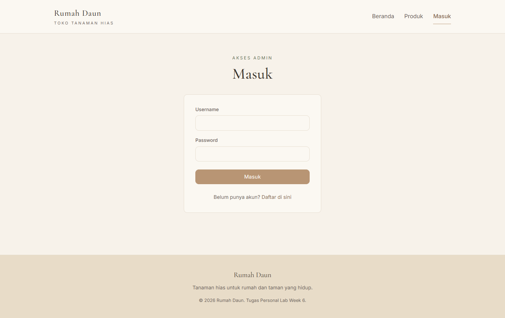
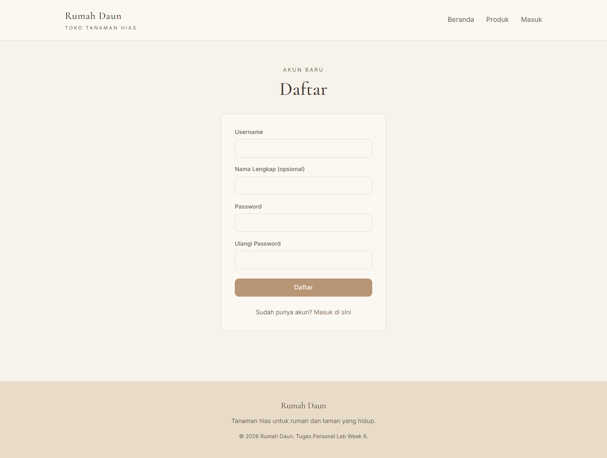
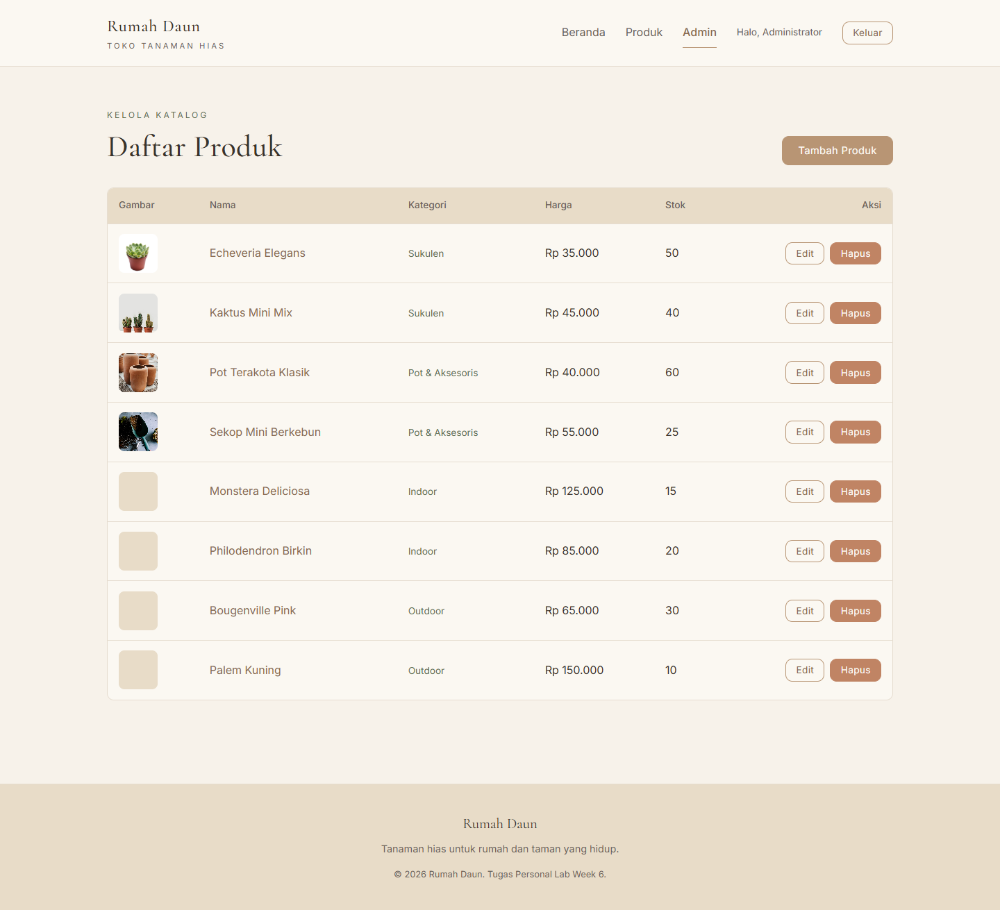
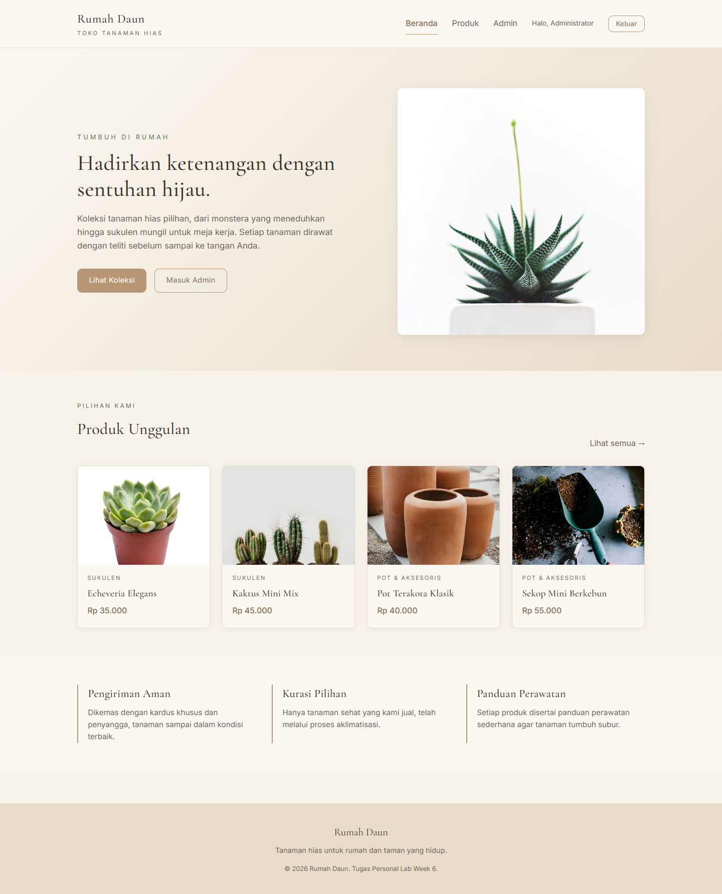

# Dokumentasi Tugas Personal Lab ke-2 (TP2)

**Topik**: Membangun Toko Web Online (Frontend and Backend Development for Web)
**Week**: 8
**Project**: Rumah Daun, Toko Tanaman Hias Online (lanjutan dari TP1)

---

## A. Ringkasan Penambahan TP2

TP2 adalah lanjutan dari TP1. Aplikasi yang sebelumnya sudah punya fitur CRUD produk (frontend React + backend Express + MongoDB Atlas) ditambahi tiga komponen baru sesuai rubrik:

| Fitur | Bobot | Implementasi |
|-------|-------|--------------|
| Autentikasi JWT (LO3) | 35% | Halaman Login & Registrasi, backend memverifikasi user, token JWT disimpan di localStorage, route admin diproteksi |
| Deployment (LO4) | 30% | Frontend dan backend keduanya sudah live di Vercel sejak TP1, di TP2 ditambah env var `JWT_SECRET` dan `VITE_GA_ID` |
| Monitoring (LO4) | 35% | Google Analytics 4 (GA4) terintegrasi via `react-ga4`, mencatat pageview di setiap perubahan route |

---

## B. Live Demo

Aplikasi dapat diakses langsung tanpa instalasi:

- **Frontend**: <https://rumah-daun.vercel.app>
- **API Backend**: <https://toko-tanaman-api.vercel.app>

Akun admin yang sudah disiapkan untuk pengujian:

| Field | Nilai |
|-------|-------|
| Username | `admin` |
| Password | `admin123` |

Login dilakukan di halaman <https://rumah-daun.vercel.app/login>. Setelah login, link **Admin** di navbar baru bisa diakses.

---

## C. Autentikasi JWT

### Skema

- Public (tanpa login): Beranda, Daftar Produk, Detail Produk, Login, Register.
- Private (wajib login): Admin (daftar, tambah, edit, hapus produk).
- Backend memvalidasi token JWT pada request POST/PUT/DELETE produk. Request GET tetap publik.

### Backend

Tiga file baru dan satu file route diubah pada folder `backend/src/`:

```
backend/src/
  models/User.js                Skema user (username unik, password di-hash bcrypt)
  controllers/authController.js Handler register, login, me
  routes/authRoutes.js          POST /api/auth/register, /login; GET /me
  middleware/auth.js            Verifikasi header Authorization: Bearer <token>
  routes/productRoutes.js       Tambah requireAuth pada POST/PUT/DELETE
```

Endpoint baru:

| Method | URL | Body | Proteksi |
|--------|-----|------|----------|
| POST | /api/auth/register | `{username, password, name?}` | Publik |
| POST | /api/auth/login | `{username, password}` | Publik |
| GET | /api/auth/me | (header: Bearer token) | Wajib token |

Response sukses login/register:

```json
{
  "token": "eyJhbGciOiJIUzI1NiIs...",
  "user": { "_id": "...", "username": "admin", "name": "Administrator" }
}
```

Token JWT memuat `sub` (user id) dan `username`, ditandatangani dengan secret `JWT_SECRET`, masa berlaku 7 hari.

### Frontend

Tujuh file baru/diubah pada folder `frontend/src/`:

```
frontend/src/
  api/client.js                 Axios interceptor: inject Bearer token, auto logout saat 401
  contexts/AuthContext.jsx      Provider state user + login/register/logout
  components/PrivateRoute.jsx   Wrapper yang redirect ke /login jika belum auth
  components/Navbar.jsx         Tampilkan "Halo, <nama>" dan tombol Keluar saat login
  pages/Login.jsx               Form login
  pages/Register.jsx            Form daftar
  App.jsx                       Bungkus /admin dengan PrivateRoute, tambah route /login & /register
  main.jsx                      Bungkus aplikasi dengan AuthProvider, panggil initAnalytics
```

Token disimpan di `localStorage` dengan key `rd_token`. Saat user mengakses halaman admin tanpa token, otomatis dialihkan ke `/login`. Jika token tidak valid lagi (401 dari backend), `localStorage` dibersihkan dan user dilempar ke `/login?expired=1`.

---

## D. Deployment

Hosting kedua bagian aplikasi memakai Vercel (gratis, integrasi langsung dengan repo GitHub).

| Komponen | URL | Konfigurasi |
|----------|-----|-------------|
| Frontend (React + Vite) | <https://rumah-daun.vercel.app> | `frontend/vercel.json` rewrite semua path ke `/index.html` agar React Router jalan |
| Backend (Express serverless) | <https://toko-tanaman-api.vercel.app> | `backend/vercel.json` rewrite `/(.*)` ke `/api`, handler di `backend/api/index.js` membungkus app Express dan cache koneksi mongoose |

Environment variables di Vercel:

**Project `toko-tanaman-api` (backend)**:
- `MONGO_URI`: connection string MongoDB Atlas
- `JWT_SECRET`: secret untuk tanda tangan JWT (baru di TP2)

**Project `toko-tanaman` (frontend)**:
- `VITE_API_URL`: <https://toko-tanaman-api.vercel.app/api>
- `VITE_GA_ID`: `G-JZDZNKH1W5` (baru di TP2)

Setiap commit ke `main` di repo GitHub bisa men-trigger redeploy otomatis. Pada TP2 deployment dilakukan via Vercel CLI dari mesin lokal setelah perubahan code rampung.

---

## E. Monitoring (Google Analytics 4)

### Setup

1. Property GA4 dibuat di <https://analytics.google.com/> dengan nama **Toko-Online**.
2. Data stream tipe **Web** ditambahkan dengan URL `https://rumah-daun.vercel.app`.
3. **Measurement ID** `G-JZDZNKH1W5` disimpan ke env var `VITE_GA_ID` pada Vercel.

### Integrasi di Frontend

File `frontend/src/analytics.js` membungkus library `react-ga4`:

```js
import ReactGA from "react-ga4";

const GA_ID = import.meta.env.VITE_GA_ID;
let initialized = false;

export function initAnalytics() {
  if (initialized || !GA_ID) return;
  ReactGA.initialize(GA_ID, { gaOptions: { anonymizeIp: true } });
  initialized = true;
}

export function trackPageview(path) {
  if (!initialized) return;
  ReactGA.send({ hitType: "pageview", page: path });
}
```

`initAnalytics()` dipanggil sekali saat aplikasi mount (di `main.jsx`). Komponen `PageviewTracker` di `App.jsx` mengirim event pageview setiap `useLocation()` berubah, jadi tiap navigasi React Router tercatat di GA.

### Verifikasi

Saat membuka <https://rumah-daun.vercel.app>, browser memuat skrip dari `googletagmanager.com/gtag/js?id=G-JZDZNKH1W5` dan mengirim event ke `google-analytics.com/g/collect`. Data muncul di dashboard GA, terutama bagian **Realtime** (segera setelah kunjungan) dan **Reports → Engagement → Pages and screens** (setelah beberapa menit).

---

## F. Cara Menjalankan Lokal

### 1. Persiapan

Versi Node.js 20+ dan akun MongoDB Atlas (sudah dijelaskan pada TP1) wajib tersedia.

```bash
git clone <repo-anda>
cd toko-online
```

### 2. Backend

```bash
cd backend
cp .env.example .env
# isi MONGO_URI dan JWT_SECRET pada .env
npm install
npm run seed         # opsional: isi 8 produk + akun admin (admin / admin123)
npm run dev          # http://localhost:5000
```

### 3. Frontend

Buka terminal baru.

```bash
cd frontend
cp .env.example .env
# isi VITE_API_URL dan VITE_GA_ID pada .env (boleh kosongkan VITE_GA_ID untuk lokal)
npm install
npm run dev          # http://localhost:5173
```

---

## G. Cara Test Fitur Baru

1. Buka <https://rumah-daun.vercel.app/admin> dalam mode incognito. Anda akan langsung diredirect ke `/login` karena belum punya token.
2. Klik **Daftar di sini** untuk uji halaman registrasi, atau langsung login dengan akun seed:
   - Username: `admin`
   - Password: `admin123`
3. Setelah login, navbar berubah: muncul tulisan `Halo, Administrator` dan tombol **Keluar**. Link **Admin** kini bisa diakses.
4. Coba lakukan create/update/delete produk di halaman Admin untuk memverifikasi token JWT diterima backend.
5. Klik **Keluar** untuk logout. Token akan dihapus dari `localStorage` dan link Admin kembali tertutup.

Untuk verifikasi monitoring, buka GA Realtime di <https://analytics.google.com/> property **Toko-Online**, lalu navigasi di aplikasi pada tab lain. Jumlah user aktif dan event pageview akan terlihat dalam beberapa detik.

---

## H. Screenshot

### 1. Halaman Login



### 2. Halaman Registrasi



### 3. Akses /admin Tanpa Login (Otomatis Redirect)


### 4. Admin Setelah Login



### 5. Beranda dengan Navbar Logged-In



### 6. Dashboard Google Analytics

*(Silakan sisipkan screenshot dashboard GA Realtime atau Engagement → Pages and screens dari property Toko-Online setelah aplikasi dipakai beberapa menit.)*

---

## I. Endpoint API (Lengkap)

| Method | URL | Body / Query | Auth |
|--------|-----|--------------|------|
| POST | /api/auth/register | `{username, password, name?}` | publik |
| POST | /api/auth/login | `{username, password}` | publik |
| GET | /api/auth/me | (header Bearer) | wajib |
| GET | /api/products | `?category=&search=` | publik |
| GET | /api/products/:id | | publik |
| POST | /api/products | `{name, price, stock, category, image?, description?}` | wajib |
| PUT | /api/products/:id | sebagian field | wajib |
| DELETE | /api/products/:id | | wajib |
| GET | /api/categories | | publik |

Header untuk endpoint berproteksi:

```
Authorization: Bearer <token-dari-login>
```

---

## J. Troubleshooting

- **Login berhasil tetapi langsung balik ke /login**
  Cek apakah `JWT_SECRET` di backend Vercel sudah di-set dan tidak kosong.

- **Network error / CORS pada produksi**
  Pastikan `VITE_API_URL` di frontend mengarah ke domain backend yang benar (`https://toko-tanaman-api.vercel.app/api`).

- **Realtime GA kosong**
  GA butuh beberapa detik hingga menit untuk menampilkan event. Pastikan ad-blocker tidak aktif saat mengetes, lalu buka Realtime di dashboard.

- **`{ "message": "Token tidak valid atau kedaluwarsa" }`**
  Token JWT default berlaku 7 hari. Logout dan login ulang akan menghasilkan token baru.
